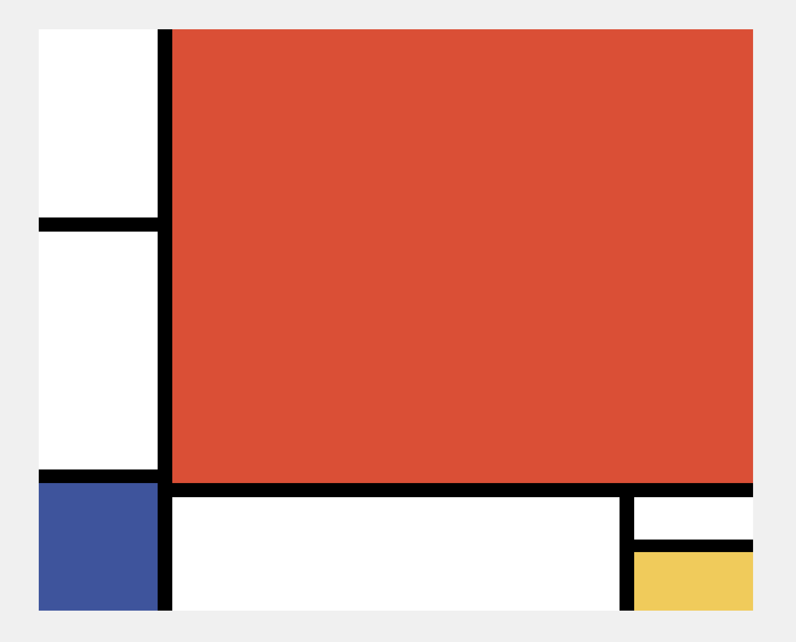

# Create art like Piet Mondrian

Inspired by the artist [Piet Mondrian](https://en.wikipedia.org/wiki/Piet_Mondrian) I've created a tool to allow you to create your own artwork. You can drag the borders for resizing, add or remove squares and colour in squares only using the Mondrian's colour scheme.

Once you have completed your design you can "paint" the artwork onto a new page.