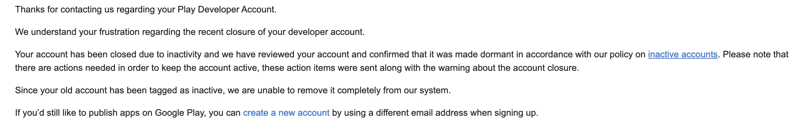

# RANT - Android Development Account

[rant](results?q=rant) / Sep 02, 2024

**TL;DR:** Why is inactivity a reason to perma ban an account? can there not be a dormant state or re-pay the joining fee?

---

Both Android and Apple require a fee to enable a developer to post apps on their market. The fee is the first step before even uploading any test apps or files, its like a admin fee when buying a festival ticket, but lets you access their market place as a developer. The cost is suppost to go to running their platform and policing it. It also probably helps in reducing very redundant apps or botting multiple accounts.

When I first made a game on Unity I wanted to publish to both Apple and Android, I paid the one time fee of £50 for Android but found the yearly fee of Apple of £100 unrealistic for a beginner developer just publishing for fun. From that moment onwards I always praised Androidn developer journey over Apple, especially with the additional percentage taken from any purchases made on the apple marketplace.

After making the app and deploying on Android I moved on to other tech and ignored my developer account for a few years. Recently I wanted to re-deploy my app cleaning up the repo and deploy another app I was playing with on Flutter. I found my account to be permanently banned!!! Considering I had only deployed one simple friendly game a few years ago I was very confused to why I would get banned, scratching my head to what malicous act I had conducted to get banned of the platform - PERMANENTLY.

After conversing with Android store support I discovered I had ignored an email saying if I had not logged into my account, I would get perma banned. I asked if I could re-pay the joining fee so I can still use my same email or why it wasn't moved to a dormant or inactive state? however, the support team had little control or answers to why. Big ol Google had made their mind up, account is gone. Annoyingly the solution the support team and I got to was to just create a new google account with another email address!!!

If you're reading this Android Development Team, pls reconsider this "cleanup" and stop me from making dummy google accounts!?
