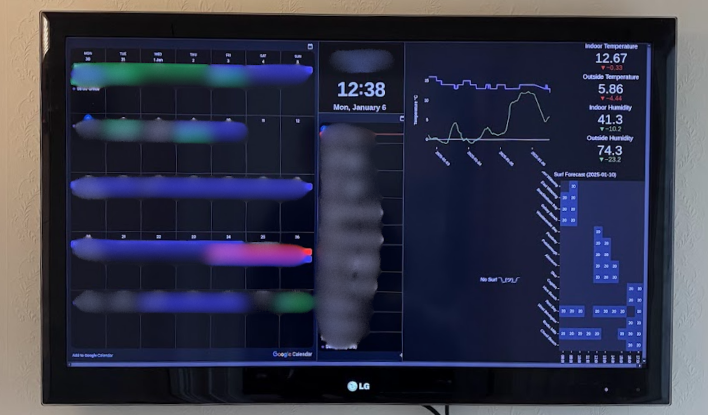
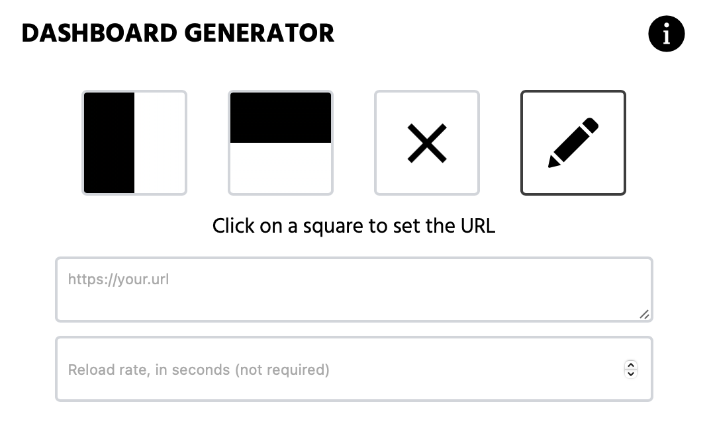

# Create a dashboard

Using the [dashboard generator](dash.goobill.com) you can embed different websites into one web page. The app allows you to customise the layout by adding or removing squares and dragging the borders to resize them.

Each square can be assigned a website/url to render the website inside that square. If the website needs to be refreshed at specific intervals, the rate at which the page is refreshed can be assinged in seconds.

**warning:** When embedding some websites onto your dashboard, they may not render. The reason is due to some websites not allowing you to put their website inside another website. For a more technical explination research CORs and iFrames.

# Widgets

Some example websites which can be used as widgets.

Widget | Website
--- | ---
Digital Clock | https://dayspedia.com/widgets/digit/
Sun rise - Sun set | https://dayspedia.com/sun/
Google Calendar | https://support.google.com/calendar/answer/41207?hl=en
Weather | https://www.weatherandradar.co.uk/weather-widget

**tip:** Some widget websites may show an iframe which you can't directly use with the dashboard generator. For example:

    <iframe src="https://goobill.com" scrolling="no" width="290" height="318" frameborder="0" style="border: 1px solid #10658E;border-radius: 8px"></iframe>

Where the code above has `src="https://goobill.com"`, you can copy the url (https://goobill.com) and use that with the dashboard generator.

# Background

I created the dashboard generator so that I could put multiple dashboards into one browser. I was annoyed with managing multiple browser tabs and not being able to full screen mode mutliple tabs next to each other.
